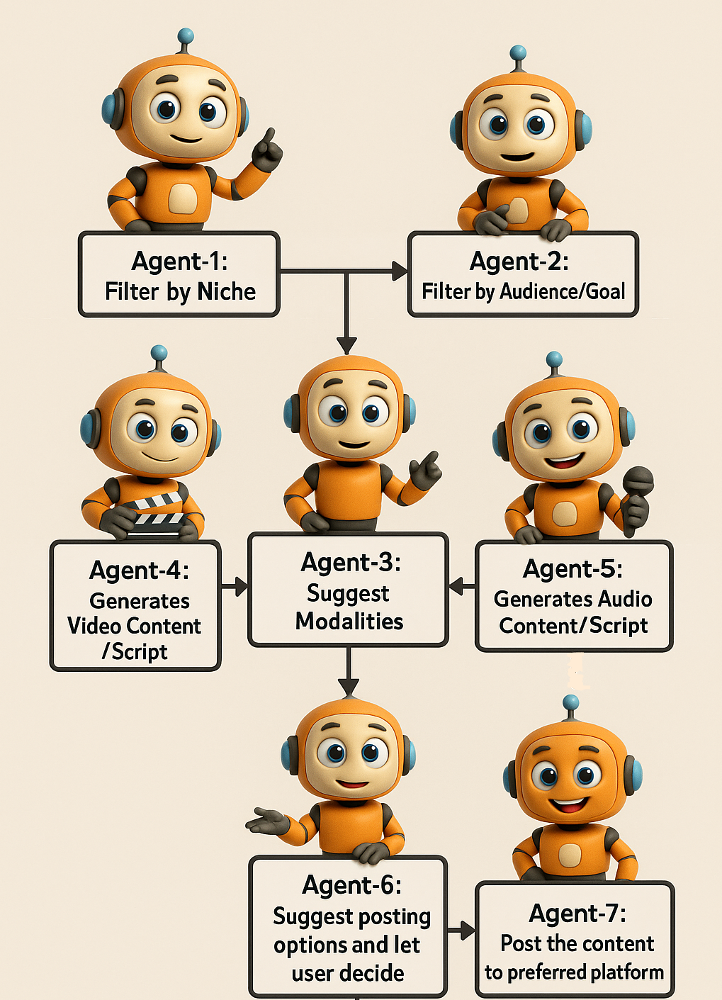

# 🎬 AI Production Studio

**AI Production Studio** is a fully automated, GenAI-powered content engine designed to create multi-format content — summaries, audio scripts, video scripts, and visuals — based on real-time trends, niche preferences, and audience targeting. It's your personal AI content team, working 24/7 to ideate, script, narrate, and present!

---

## 🚀 Features

- 🔍 **Trend Hunter Agent** – Fetches real-time trending topics using SerpAPI  
- 🧠 **Audience Mapper & Format Strategist** – Aligns content to niche, audience, and growth goals  
- 🧩 **Multi-Agent System** – Modular agents work independently or in parallel (e.g., video & audio generation)  
- ✍️ **Summary, Audio & Video Script Writers** – Generates high-quality, multi-modal content  
- 🗣️ **Audio Narration** – Uses ElevenLabs for podcast-style natural voiceovers  
- 🎥 **Video Generation** – Transforms scripts into visuals using frame parsing  
- 🖥️ **Streamlit UI** – Intuitive and responsive interface for end-to-end content creation  
- 📦 **Includes Demo Output** – Sample video and audio files provided
  
---

## ⚙️ Architecture Overview

This project is built on a **modular, agent-based architecture**, where each autonomous agent handles a distinct function:

- `trend_hunter`: Fetches live trends (via SerpAPI)  
- `audience_mapper`: Aligns topics with target demographics  
- `format_strategist`: Selects suitable content formats  
- `summary_writer`, `video_script_writer`, `audio_script_writer`: Create content in various modalities  
- `video_generator` & `audio_generator`: Run in **parallel** for faster multimedia output  
- `editor_in_chief`: Finalizes content before publishing  

<br>



---

## 📁 Folder Structure

```
📂 ai_production_studio/
├── agents/                      # All autonomous agent logic
├── final_dynamic_video.mp4      # Output video sample
├── output_audio.mp3             # Output audio sample
├── final_image.png              # Agent Flow
├── .env.example                 # Environment variable template
├── app.py                       # Streamlit app launcher
├── requirements.txt             # Python dependencies
└── README.md                    # This file
```

---

## 🧪 Tech Stack

- **Frontend**: Streamlit  
- **AI Models**: Gemini Pro, GPT-3.5  
- **Voice**: ElevenLabs  
- **Trends & Search**: SerpAPI  
- **Agent Coordination**: Python + Concurrent Futures   

---

## ▶️ Demo Outputs

- **🎥 Video Output**: `final_dynamic_video.mp4`  
- **🎧 Podcast Audio**: `output_audio.mp3`  

---

## ⚙️ Getting Started

### 1. Clone the repo

```bash
git clone https://github.com/Bhumika158/AI_Production_House.git
cd AI_Production_House
```

### 2. Set up your environment

Install Python packages:

```bash
pip install -r requirements.txt
```

Copy the `.env.example` to `.env` and add your API keys:

```bash
cp .env.example .env
```

Edit `.env` and fill in your:
- OpenAI API Key  
- Gemini or Mistral endpoints  
- ElevenLabs API Key (optional)  

### 3. Run the Streamlit App

```bash
streamlit run app.py
```

---

## 🤝 Contributions

Pull requests are welcome! Feel free to propose enhancements, add new agent roles, or improve outputs.

If you find this useful, give it a ⭐️ and share it with others!

---

## 📫 Contact

Built with ❤️ by [Bhumika Peshwani](https://www.linkedin.com/in/bhumika-peshwani-732814193/)  
Open to collaborations on AI-powered creator tools, automation workflows, and content agents.

---

## 📢 License

This project is open source under the MIT License.
